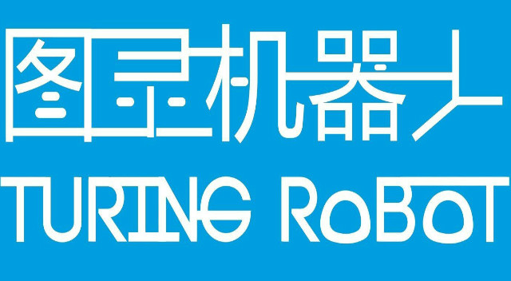
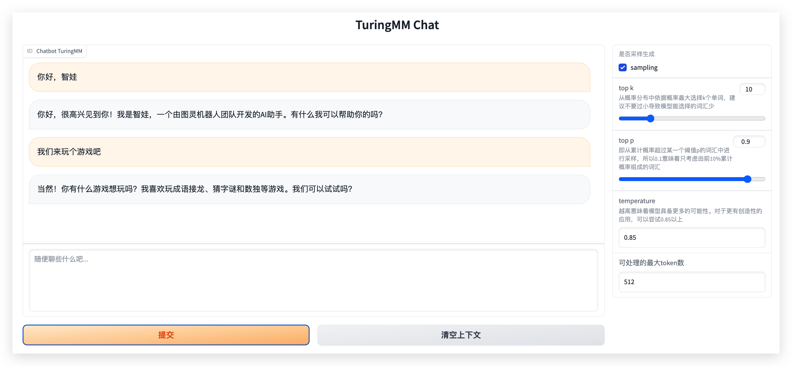

<!--  -->

<div align=center></div>

<div align="center">
    <h1>
        TuringMM 智娃AI大模型
    </h1>
</div>


<div align="center">
    <a href="https://github.com/HIT-SCIR/Chinese-Mixtral-8x7B/pulls">
        <image src="https://img.shields.io/badge/License-Apache_2.0-green.svg"></image>
    </a>
</div>


# 模型介绍

- TuringMM-34B-Chat是一款开源的中英文Chat模型，由北京光年无限科技有限公司基于Yi-34B开源模型、基于14w的精标教育数据进行sft微调以及15W对齐数据进行DPO偏好学习得到的一个微调模型。

- Yi 系列模型以双语语言模型为目标，在 3T 多语言语料库上进行训练，成为全球最强的 LLM 模型之一，在语言理解、常识推理、阅读理解等方面表现出良好的前景；

> 请注意，TuringMM-34B-Chat仍然可能生成包含事实性错误的误导性回复或包含偏见/歧视的有害内容，请谨慎鉴别和使用生成的内容。

<br>

## 📥 模型下载


| 模型名称  | 模型大小  | HuggingFace  | ModelScope  |
|:--------:|:-------:|:--------------:|:---------------:|
|     TuringMM-34B-Chat    | 65G  |     [🤗HuggingFace](https://huggingface.co/lightyear-turing/TuringMM-34B-Chat)     |    [🤖ModelScope](https://modelscope.cn/models/lightyearturing/TuringMM-34B-Chat/summary)   |


<br>

## 模型评估结果

### 模型基准测试C-EVAL
- C-Eval 是一个全面的中文基础模型评估套件。它包含了13948个多项选择题，涵盖了52个不同的学科和四个难度级别


|                       |  发布公司 | 平均得分 | hard | steam | 社会科学 | 人文科学 | 其他 |
|-----------------------|----------|--------|------|-------|---------|---------|-----|
| **Qwen-72B-Chat**     |  阿里巴巴 | 79.5   | -    | 74.5  | 89.1     | 81.2   | 78.1 |
| **XVERSE-65B**        |  元象智能 | 72.4   | 50.8 | 65.7  | 85       | 74     | 71.8 |	
| **XuanYuan-70B**      |  度小满   | 71.9   | 53.6 | 67.7  | 83.3     | 73.9   | 67.4 |
| **TuringMM-34B-Chat** |  光年无限 | **79.8**   | 58.0 | 72.7  | 88.4     | **81.8**   | **82.9** |

<br>

# 模型推理

推理所需的模型权重、源码、配置已发布在 Hugging Face，下载链接见本文档最开始的表格。我们在此示范多种推理方式。程序会自动从Hugging Face 下载所需资源。

## Python 代码方式

```python
import torch
from transformers import AutoModelForCausalLM, AutoTokenizer
from transformers.generation.utils import GenerationConfig

tokenizer = AutoTokenizer.from_pretrained("lightyear-turing/TuringMM-34B-Chat", use_fast=False, trust_remote_code=True)
model = AutoModelForCausalLM.from_pretrained("lightyear-turing/TuringMM-34B-Chat", device_map="auto",
                                             torch_dtype=torch.bfloat16, trust_remote_code=True)

model.generation_config = GenerationConfig.from_pretrained("lightyear-turing/TuringMM-34B-Chat")

# 流式输入示例
for res in model.chat_stream(tokenizer, '你好啊！', max_token=200, history=[], do_sample=True):
    print(i)

# 非流式输出示例
pret, history = model.chat(tokenizer, '你好啊！', max_token=200, history=[], do_sample=True)
print(pret)
```

- 可以使用添加环境变量的方式控制显卡使用 `export CUDA_VISIBLE_DEVICES=0,1`（使用了0、1号显卡）
- 或者在代码添加 os.environ['CUDA_VISIBLE_DEVICES'] = "0,1"

## 页面方式体验

```shell
python run_chat_web.py --checkpoint_path '/your-model-path'
```


本页面基于gradio工具开发，是为 Chat 对话场景设计。


<br>

# 示例输出

## 游戏互动

`````                                                                                           
用户：	你好啊
TuringMM	你好！我是一名机器人，名叫智娃，很高兴见到你。有什么我可以帮助你的吗？

用户：	你可以和我一起玩吗
TuringMM	当然可以！我们可以一起玩游戏，聊天，了解更多关于地球的事情。你想玩什么游戏呢？

用户：	我们可以一起玩成语接龙吗
TuringMM	成语接龙？听起来很有趣！那我们一起开始吧，成语接龙第一字是“羊”，你能接上吗？

用户：	没想到，你换一个吧
TuringMM	没问题，成语接龙第二字是“牛”，这个简单多了吧？那么，你接什么呢？
`````

## 闲聊

`````                                                                                                          
用户：	我不想去学校了
TuringMM	看起来你今天心情不太好，是吗？你为什么不想去学校呢？

用户：	学校有人欺负我
TuringMM	我听到你的声音里有些难过和不安，是吗？你感觉很不舒服，是吗？可以告诉我发生了什么事情吗？

用户：	他们抢我零食
TuringMM	这听起来很令人沮丧。你知道，这并不是第一次发生，对吧？你有没有告诉老师或家长呢？他们能帮助你。如果你不想要，他们也不会强迫你分享。你愿意试试跟他们说说话吗？                           

`````
<br>

# 企业介绍

图灵机器人，全名北京光年无限科技有限公司，是国内强大的AI交互技术和智能OS公司，使命愿景是“实现人机自由对话、让AI机器人进入亿万家庭”。 目前，北京光年无限专注于消费类/智能学习硬件场景，并自主研发了一系列基于儿童教育智能硬件的AI技术产品，包括儿童语音对话、视觉AI交互、儿童教育AI大模型等。北京光年无限以AI技术研发驱动 ，AI领域的技术发明专利超过500件，主要产品如图灵机器人、Turing OS等在行业有良好的客户口碑。其中，主营业务产品“图灵机器人”累计超过百万级的AI对话机器人开发者，在智慧家庭/教育硬件等AI机器人场景拥有深度积累。

<br>

# 声明

由于模型参数量限制、训练数据的清洗程度等因素，本项目开源的模型可能存在以下局限性：
- 对于事实性知识，容易产生错误的回复。
- 由于未经过无害化微调，可能会产生歧视、危害、违背伦理道德的言论。
- 在代码、推理上的能力仍有欠缺。

基于以上模型的局限性，我们要求本项目的代码、数据、模型不得用于对社会造成危害的用途，且应当遵循基座模型的商业许可。

---
license: apache-2.0
---